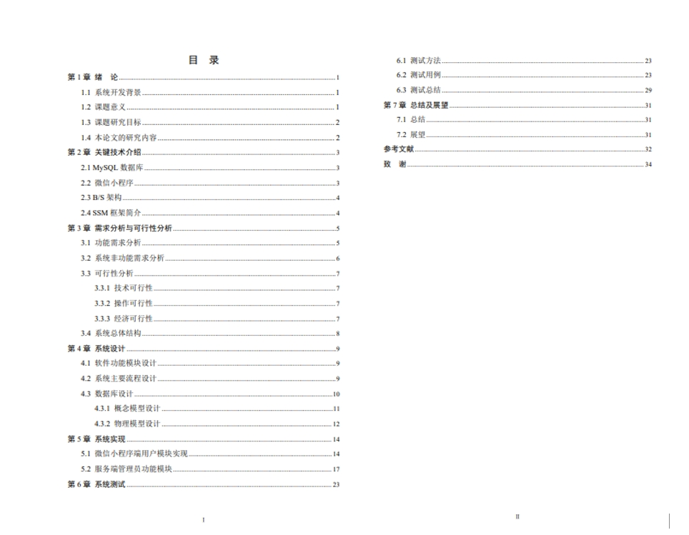

# 1.项目介绍
- 功能模块：用户管理、年龄类型管理、阶段食谱管理、体质类型管理、季节食谱管理、职业食谱管理等
- 系统角色：管理员、普通用户
- 技术栈：SSM，uniapp， Vue等
- 测试环境：idea2024，HbuilderX，微信开发工具，MySQL5.7，Maven3，Navicat
# 2.项目部署
## 2.1 后端部署
- 创建数据库，导入sql
- 通过idea打开项目，根据本地数据库环境修改src/main/resources/config.properties  3-5行
- 配置tomcat，将路径配置为/ssmy37ci（因为小程序请求路径是这个，当然可以自行定义）
- 启动项目，后端管理web：本机IP:8080/ssmy37ci/admin/dist/index.html  管理员账号密码：abo/abo
## 2.2小程序部署
- 在项目中有个src/main/webapp/front/unpackage/dist/dev/mp-weixin，这是我编译后的小程序代码，你可以直接使用微信开发工具打开，如有问题，你按照下面步骤做。
- 通过HbuilderX，打开src/main/webapp/front
- 修改mainfest.json里的微信小程序appid为你的测试小程序appid，基本配置里的uniapp应用标识重新获取一下
- 点击运行>运行到小程序模拟器 > 微信小程序
# 3.项目部分截图 

# 4.获取方式
[戳我查看](https://gitee.com/aven999/mall)